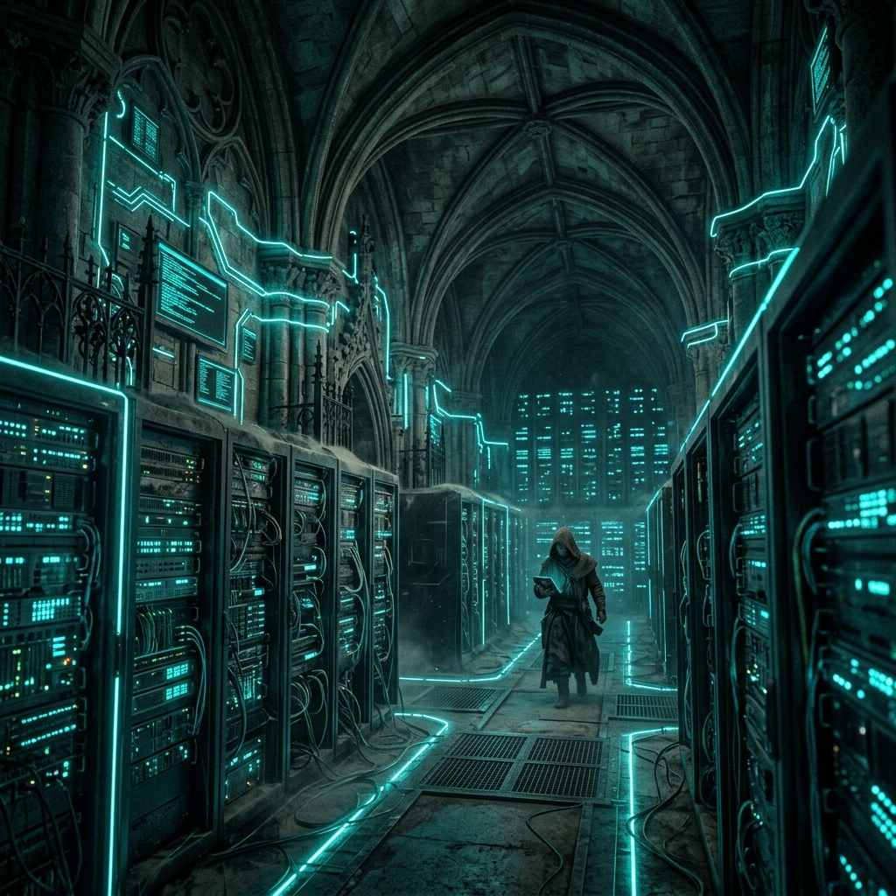

# Visuals & Interaction

The Filed & Forgotten theme is designed to handle rich media and interactive elements seamlessly.

## Hero Images

You can include full-width images to break up long sections of text. All images are automatically styled with rounded corners and subtle borders.


*Figure 1: A visualization of the deep archive.*

## Buttons

We've provided a simple way to create call-to-action buttons using standard HTML within your markdown.

<a href="/guides/typography" class="btn">View Typography Guide</a>
<a href="#" class="btn btn-secondary">Download Log</a>

To create these, use the following HTML structure:

```html
<a href="#" class="btn">Primary Button</a>
<a href="#" class="btn btn-secondary">Secondary Button</a>
```

## Responsive Images

Images automatically scale to the width of the content container, ensuring they look great on both desktop and mobile devices.


